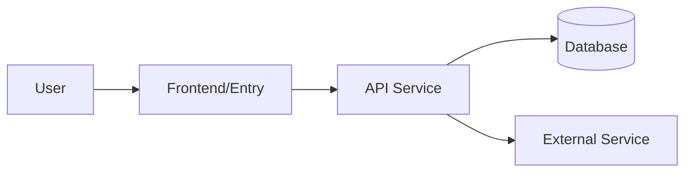

# Lightweight Architecture View Guide

Use this guide when the project has multiple apps, services, workers, databases, third-party systems, or complex module dependencies. Small projects do not need forced diagrams; prose and tables are enough.

## Principles

- Infer architecture from code and configuration; do not invent components for visual polish.
- State evidence before presenting the view.
- Use diagrams or tables only when they improve understanding.
- Mark missing information as "Unconfirmed" rather than filling gaps with guesses.

## View Levels

### 1. System Context

Describe users, external systems, and primary data flows.

Suggested format:

```markdown
### System Context

- Users:
- External systems:
- Inputs:
- Outputs:
- Core value chain:
```

### 2. App/Service View

Use this when the project includes frontend apps, backend services, workers, databases, caches, queues, or third-party services.

Suggested format:

```markdown
### App/Service View

| Unit | Type | Responsibility | Dependencies | Evidence |
| --- | --- | --- | --- | --- |
```

### 3. Module/Component View

Use this to explain core business modules and dependency direction.

Suggested format:

```markdown
### Module/Component View

| Module | Location | Responsibility | Upstream | Downstream |
| --- | --- | --- | --- | --- |
```

### 4. Key Call Chain

Use this to explain how a core feature moves across layers.

Suggested format:

```markdown
### Key Call Chain

1. User/entry point:
2. Route/API/command:
3. Business service:
4. Data access:
5. External dependencies:
6. Return value/side effects:
```

## Optional Mermaid Format

If the user asks for a diagram, or relationships are too complex for a table, include a short Mermaid diagram. Do not use it when information is insufficient.



## When Not to Draw

- The project has only a few files and module relationships are obvious.
- The user only provided partial code and system boundaries cannot be confirmed.
- The diagram would repeat the table without adding understanding.
- Key dependency relationships have not been confirmed from code or configuration.
