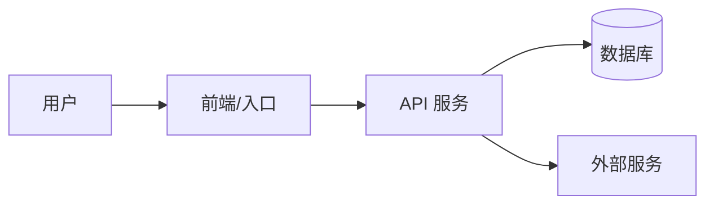

# 轻量架构视图指南

当项目存在多个应用、服务、worker、数据库、第三方系统或复杂模块依赖时，使用本指南帮助输出架构视图。小项目不需要强行画图，使用文字和表格即可。

## 使用原则

- 从代码和配置反推架构，不要为了好看而虚构组件。
- 先说明证据来源，再给视图。
- 图或表只服务理解，不追求完整建模。
- 如果信息不足，用“未确认”标记，不要补脑。

## 视图层次

### 1. 系统上下文

说明项目服务的用户、外部系统和主要数据流。

可用格式：

```markdown
### 系统上下文

- 使用者：
- 外部系统：
- 输入：
- 输出：
- 核心价值链：
```

### 2. 应用/服务视图

当项目包含前端、后端、worker、数据库、缓存、队列或第三方服务时使用。

可用格式：

```markdown
### 应用/服务视图

| 单元 | 类型 | 职责 | 依赖 | 证据 |
| --- | --- | --- | --- | --- |
```

### 3. 模块/组件视图

用于说明核心业务模块和依赖方向。

可用格式：

```markdown
### 模块/组件视图

| 模块 | 位置 | 职责 | 上游 | 下游 |
| --- | --- | --- | --- | --- |
```

### 4. 关键调用链

用于说明一个核心功能如何跨层流动。

可用格式：

```markdown
### 关键调用链

1. 用户/入口：
2. 路由/API/命令：
3. 业务服务：
4. 数据访问：
5. 外部依赖：
6. 返回/副作用：
```

## Mermaid 可选格式

如果用户需要图，或者关系复杂到表格不够清晰，可以输出简短 Mermaid。不要在信息不足时使用。



## 何时不要画图

- 项目只有少量文件，模块关系一眼可见。
- 用户只提供了局部代码，无法确认系统边界。
- 图会重复表格内容，不提供额外理解价值。
- 关键依赖关系尚未从代码或配置中确认。
